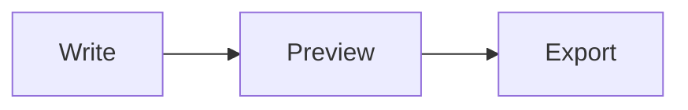

# Complete Markdown Preview

#### Heading level four

**Bold**, *italic*, ~~strikethrough~~, and `inline code`.

[A safe link](https://example.com) and .

> A blockquote with **formatted text**.

1. Ordered item
2. Another item
   - Nested unordered item

- [x] Completed task
- [ ] Open task

| Feature | Status |
| :--- | ---: |
| Tables | Working |
| Alignment | Yes |

---

```javascript
const greeting = "Hello from Oud Notes";
console.log(greeting);
```

Inline math: $E = mc^2$

$$
\int_0^1 x^2\,dx = \frac{1}{3}
$$



Footnotes work too.[^detail]

[^detail]: This is a rendered footnote.

<mark>Safe inline HTML</mark>

<script>window.__unsafeMarkdownRan = true;</script>
